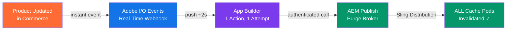
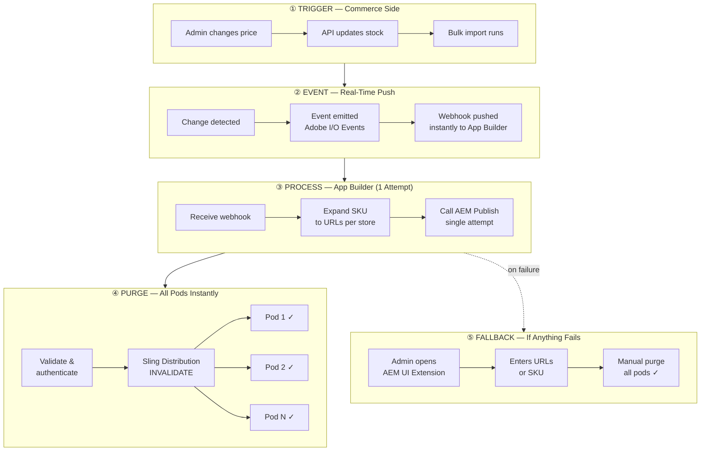
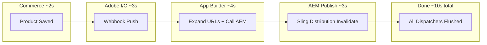
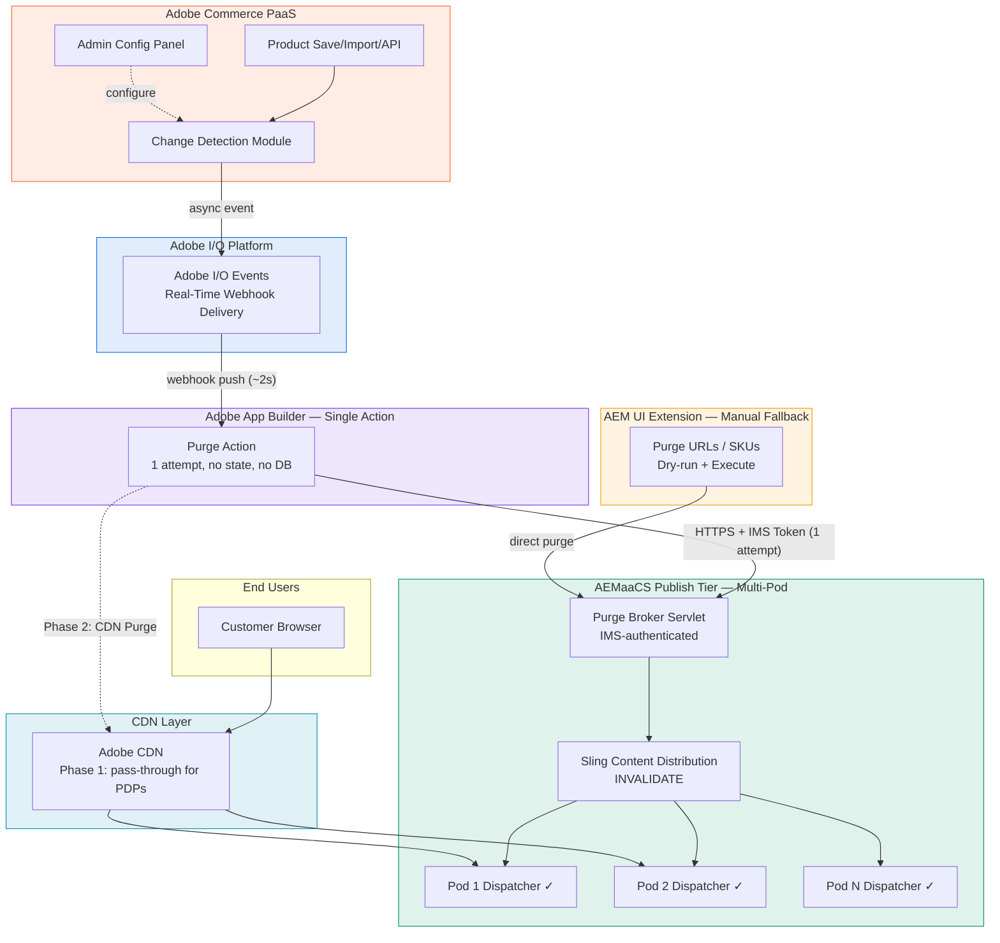
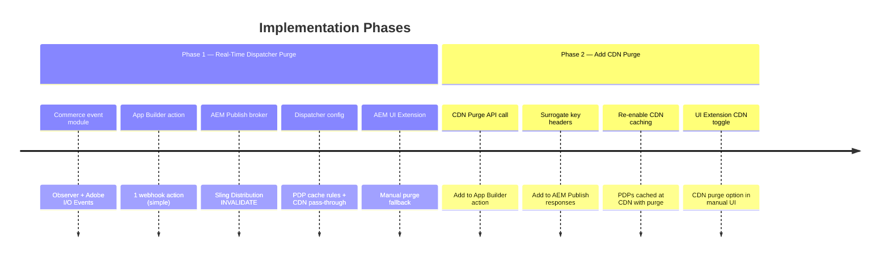

# Cache Purge & Warm-Up — Executive Architecture Overview

**For:** Leadership Approval  
**Version:** 2.0 — Simplified Real-Time Architecture  
**Date:** 2026-05-23  
**Status:** Pending Approval  
**Approach:** Real-Time Webhook | 1 Attempt | Manual Fallback | ~10s Freshness

---

## The Problem

When a product's price, name, or image changes in Adobe Commerce, the website continues showing **stale/outdated content** to customers because cached pages aren't automatically refreshed.

**Impact:** Customers see wrong prices, old product names, outdated images → revenue risk, trust erosion.

**Why it's hard:** Product pages are dynamically generated — they don't exist as traditional pages in AEM, so standard "publish" buttons don't work.

---

## The Solution — One Slide View

**+ Manual Fallback:** AEM UI Extension for admin-triggered purge when needed.

---

## How It Works — Executive Flow

---

## End-to-End Timeline

**Total time: ~10 seconds** from product save to fresh content available.

No polling delays. No batching waits. Real-time webhook push.

---

## Business Value

| Benefit | Impact |
|---------|--------|
| **Correct pricing displayed** | Eliminates revenue leakage from stale prices |
| **Automated, no manual effort** | Operations team freed from manual cache clearing |
| **Multi-store support** | All markets/languages updated simultaneously |
| **Resilient** | Adobe platform retries webhook delivery; manual fallback for edge cases |
| **Observable** | Dashboard shows exactly what was purged, when, and status |
| **Secure** | Adobe IMS authentication end-to-end, no exposed endpoints |
| **Scalable** | Handles bulk imports (1000s of products) without degradation |
| **Minimal complexity** | 3 components total. No databases, no queues, no retry logic |
| **Phased rollout** | Phase 1 low-risk, Phase 2 adds CDN caching for performance |

---

## Architecture — Full View

---

## Phase Roadmap

---

## Risk Mitigation

| Risk | Mitigation |
|------|------------|
| AEM Publish temporarily unavailable | Admin uses AEM UI Extension to manually purge once recovered |
| Bulk import (1000+ products) | App Builder processes concurrently (queues beyond limit); all process within ~60s |
| Stale content | CDN disabled for PDPs in Phase 1 — Dispatcher purge = instant freshness |
| Security breach via purge endpoint | IMS authentication mandatory, URL pattern allowlist, audit logging |
| Webhook delivery fails | Adobe platform retries automatically; if still fails, admin purges manually |

---

## Cost & Investment

| Component | Adobe License | Custom Build |
|-----------|:---:|:---:|
| Adobe Commerce PaaS | Existing ✓ | Module development |
| Adobe I/O Events | Included ✓ | Event configuration |
| Adobe App Builder | Included with license ✓ | Actions + UI development |
| AEMaaCS | Existing ✓ | OSGi bundle development |
| Adobe CDN | Existing ✓ | Configuration (Phase 2) |

**All infrastructure is included in existing Adobe licenses.** Investment is development effort only.

---

## Decision Required

| # | Decision | Recommendation |
|---|----------|----------------|
| 1 | Approve Phase 1 implementation | ✅ Low risk, high value, uses existing Adobe platform |
| 2 | Approve real-time webhook approach | ✅ ~10s freshness. No polling delays. |
| 3 | Accept 1-attempt + manual fallback | ✅ Simple, reliable. Manual UI Extension for rare failures. |
| 4 | Disable CDN caching for PDPs (Phase 1) | ✅ Ensures Dispatcher purge = instant customer freshness |
| 5 | Plan Phase 2 CDN purge | ✅ Re-enable CDN caching for performance. Builds on Phase 1. |

---

## Approval

| Role | Name | Signature | Date |
|------|------|-----------|------|
| CTO / VP Engineering | | | |
| Enterprise Architect | | | |
| Product Owner | | | |
| Security Lead | | | |
