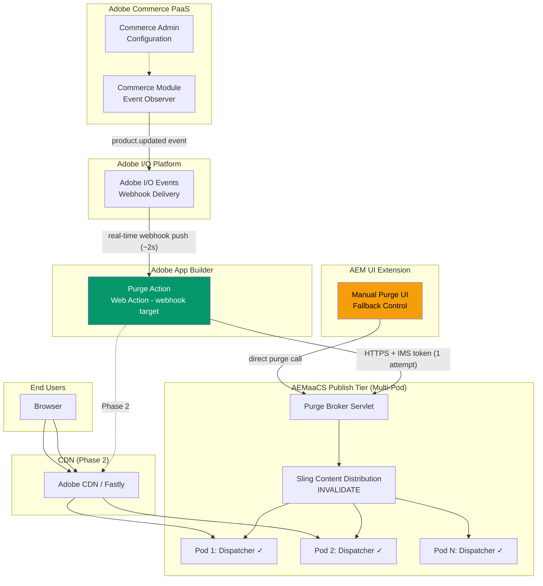
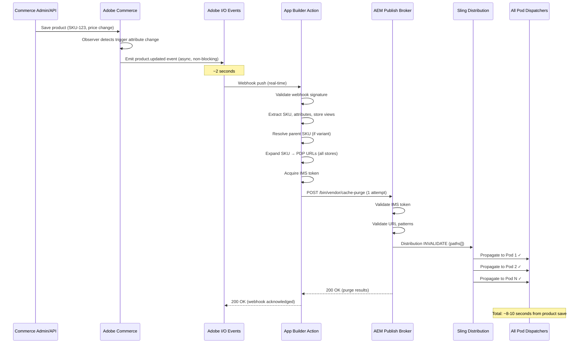
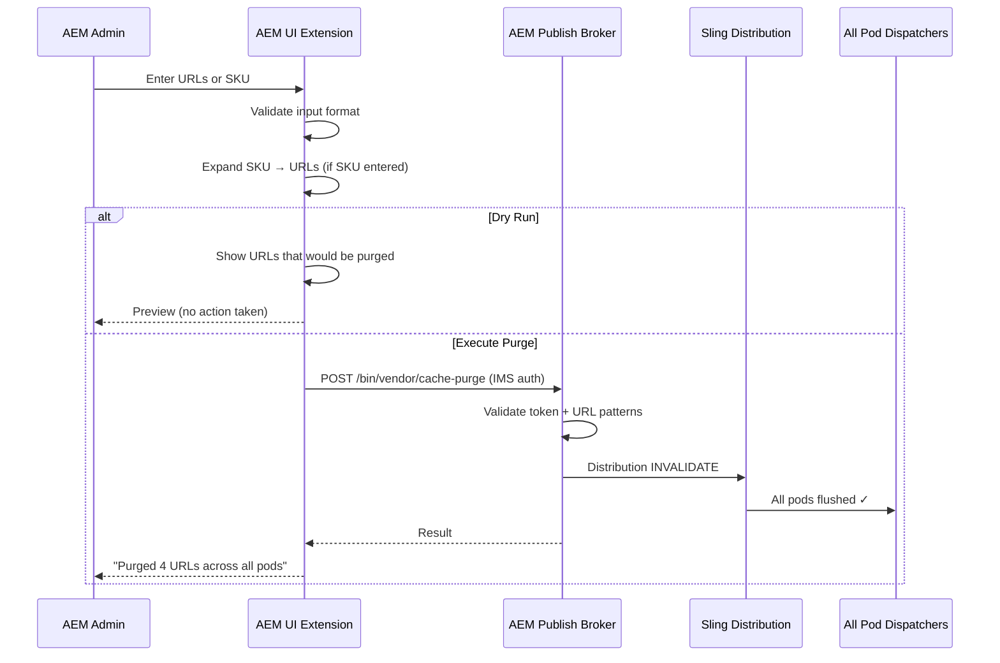
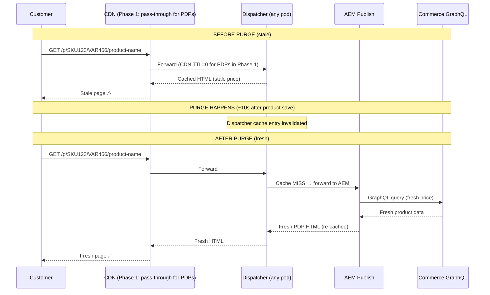
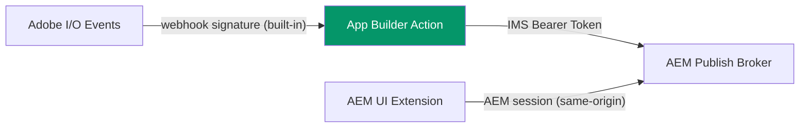

# AEMaaCS + Adobe Commerce PaaS — Cache Purge Architecture (Simplified)

**Version:** 2.0  
**Date:** 2026-05-23  
**Status:** Architecture Proposal  
**Approach:** Real-Time Webhook Push | 1 Attempt | Manual Fallback  
**Classification:** Enterprise Architecture Review Ready

---

## Table of Contents

1. [Feasibility Assessment](#1-feasibility-assessment)
2. [Target Architecture](#2-target-architecture)
3. [Integration Flow](#3-integration-flow)
4. [Component Design](#4-component-design)
5. [Sequence Diagrams](#5-sequence-diagrams)
6. [Data Model & API Contracts](#6-data-model--api-contracts)
7. [AEM UI Extension — Manual Purge](#7-aem-ui-extension--manual-purge)
8. [Dispatcher Configuration](#8-dispatcher-configuration)
9. [CDN Strategy (Phase 2)](#9-cdn-strategy-phase-2)
10. [Security Model](#10-security-model)
11. [Performance & Latency](#11-performance--latency)
12. [Phase 1 vs Phase 2 Roadmap](#12-phase-1-vs-phase-2-roadmap)
13. [Risks & Open Questions](#13-risks--open-questions)
14. [Testing Strategy](#14-testing-strategy)
15. [Final Recommendation](#15-final-recommendation)

---

## 1. Feasibility Assessment

### Verdict: **FEASIBLE** — simplified real-time approach

| Concern | Feasibility | Notes |
|---------|-------------|-------|
| Adobe I/O Events webhook delivery | ✅ Supported | Real-time push to App Builder web action (~2-3s delivery). Ref: [Adobe I/O Events Webhooks](https://developer.adobe.com/events/docs/guides/) |
| App Builder web action as webhook target | ✅ Supported | Public web actions can receive I/O Events webhook posts. Ref: [App Builder Runtime](https://developer.adobe.com/app-builder/docs/guides/runtime_guides/) |
| AEM Publish-side purge broker | ✅ Supported | Sling Servlet + Content Distribution `INVALIDATE` API propagates to ALL pods |
| Multi-pod Dispatcher invalidation | ✅ Supported | Sling Content Distribution handles fan-out internally |
| AEM UI Extension for manual purge | ✅ Supported | AEM UI Extensibility framework. Ref: [AEM UI Extensions](https://developer.adobe.com/uix/docs/) |
| No retry / no state | ✅ Viable | Purge is idempotent; webhook platform retries cover transient failures; manual fallback covers rest |

### Design Principles

| Principle | Decision |
|-----------|----------|
| **Real-time** | Webhook push (~5-10s total latency), not polling |
| **1 attempt** | App Builder action tries once. If it fails, done. |
| **No state** | No aio-lib-state, no database, no cursor, no DLQ |
| **No retry logic** | Adobe I/O Events platform handles webhook delivery retry (up to ~24h). Our code does not retry. |
| **Manual fallback** | AEM UI Extension for anything missed |
| **Idempotent** | Duplicate purges are harmless |
| **Minimal components** | 3 components total |

---

## 2. Target Architecture

### Architecture Diagram



### Three Components Only

| # | Component | Purpose |
|---|-----------|---------|
| 1 | **App Builder Purge Action** | Receives webhook, expands SKU → URLs, calls AEM broker (1 attempt) |
| 2 | **AEM Publish Purge Broker** | Validates request, triggers Sling Distribution INVALIDATE across all pods |
| 3 | **AEM UI Extension** | Manual purge fallback for admins when automation fails or is insufficient |

### Key Architectural Decisions

| # | Decision | Rationale |
|---|----------|-----------|
| AD-1 | Webhook push (not Journaling poll) | Real-time delivery (~2s), eliminates 60s polling latency |
| AD-2 | 1 attempt, no retry in our code | Adobe I/O Events retries webhook delivery. Purge is idempotent. Manual fallback covers edge cases. |
| AD-3 | No state storage | Nothing to store — stateless action processes event and calls AEM |
| AD-4 | Sling Content Distribution INVALIDATE | Only mechanism that propagates to ALL Publish pods |
| AD-5 | AEM UI Extension as manual fallback | Gives operations team direct control without complex automation |
| AD-6 | CDN TTL short/zero for PDPs (Phase 1) | Ensures Dispatcher purge = immediate customer freshness |

---

## 3. Integration Flow

### 3.1 Automated Flow (Real-Time)

```
1. Product updated in Commerce (Admin / API / Import)
2. Commerce observer detects changed attributes (configured trigger list)
3. Commerce emits Adobe I/O Event (async, non-blocking)
4. Adobe I/O Events delivers webhook to App Builder action (~2s)
5. App Builder action:
   a. Validates webhook signature
   b. Extracts SKU, product type, changed attributes, store views
   c. Resolves parent configurable SKU (if simple variant)
   d. Expands to PDP URLs per store view + domain
   e. Acquires IMS token
   f. Calls AEM Publish broker with URL list (1 attempt)
6. AEM Publish broker:
   a. Validates IMS token
   b. Validates URLs against allowed patterns
   c. Issues Sling Content Distribution INVALIDATE
   d. Framework propagates to ALL pod Dispatchers
7. Done. Customer sees fresh content on next request.
```

**Total latency: ~8-10 seconds.**

### 3.2 Manual Fallback (AEM UI Extension)

```
1. Admin notices stale content OR receives alert about failed purge
2. Opens AEM UI Extension panel
3. Enters URLs directly OR enters SKU (system expands to URLs)
4. Optionally runs dry-run validation
5. Clicks "Purge"
6. UI Extension calls AEM Publish broker directly (same servlet)
7. All pod Dispatchers invalidated
8. Admin sees confirmation with results
```

### 3.3 What Happens on Failure

| Failure Point | Behavior | Customer Impact | Recovery |
|---------------|----------|-----------------|----------|
| Commerce doesn't emit event | Bug — no purge triggered | Stale content | Admin purges manually via UI Extension |
| I/O Events webhook delivery fails | Adobe platform retries for ~24h | Delayed purge (minutes to hours) | Self-heals via Adobe retry |
| App Builder action errors out | Purge skipped for this event | Stale content | Admin purges manually |
| AEM broker returns 500 | App Builder action returns failure | Stale content | Admin purges manually once AEM recovers |
| AEM broker is down | Action fails | Stale content | Admin purges manually once recovered |

**Bottom line:** For the rare failure case, a human uses the AEM UI Extension. This is acceptable because:
- Adobe webhook delivery is ~99.9% reliable
- AEMaaCS has 99.95% uptime SLA
- Actual failures requiring manual intervention: very rare

---

## 4. Component Design

### 4.1 Adobe Commerce Module

**Module:** `Vendor_AemCachePurge`

Minimal module — only responsibility is ensuring the correct event is emitted with enriched data.

#### Configuration (System > Configuration > Services > AEM Cache Purge)

| Config | Type | Description | Source |
|--------|------|-------------|--------|
| `enabled` | boolean | Module on/off | `.env` / Admin |
| `trigger_attributes` | multiselect | Attributes that trigger purge | Admin |
| `store_domain_map` | serialized | Store view → domain mapping | Admin |
| `url_pattern` | text | PDP URL template | Admin |
| `include_stock_changes` | boolean | Stock status triggers purge | Admin |

#### Key Logic

```php
// Observer/ProductSaveAfter.php
class ProductSaveAfter implements ObserverInterface
{
    public function execute(Observer $observer)
    {
        $product = $observer->getEvent()->getProduct();
        
        // 1. Check if module is enabled
        if (!$this->config->isEnabled()) return;
        
        // 2. Detect which attributes changed
        $changedAttributes = $this->changeDetector->getChanged($product);
        
        // 3. Filter against configured trigger attributes
        $triggerAttributes = array_intersect($changedAttributes, $this->config->getTriggerAttributes());
        if (empty($triggerAttributes)) return;
        
        // 4. Event payload is enriched automatically via io_events.xml field mapping
        // Adobe I/O Events Commerce module handles the actual emission
        // We just ensure the data is available on the product model
    }
}
```

#### Event Field Mapping (io_events.xml)

```xml
<config xmlns:xsi="http://www.w3.org/2001/XMLSchema-instance">
    <event name="observer.catalog_product_save_after">
        <field name="sku" source="product.getSku()"/>
        <field name="product_type" source="product.getTypeId()"/>
        <field name="store_ids" source="product.getStoreIds()"/>
        <field name="url_key" source="product.getUrlKey()"/>
        <field name="visibility" source="product.getVisibility()"/>
        <field name="status" source="product.getStatus()"/>
        <field name="changed_attributes" source="product.getChangedAttributes()"/>
        <field name="parent_skus" source="product.getParentSkus()"/>
        <field name="old_url_key" source="product.getOrigData('url_key')"/>
    </event>
</config>
```

#### Parent SKU Resolution

The Commerce module enriches the product model with parent SKU data before event emission:

```php
// Plugin/ProductSavePlugin.php (before event emission)
public function afterSave(ProductInterface $product)
{
    if ($product->getTypeId() === 'simple') {
        $parentIds = $this->configurableType->getParentIdsByChild($product->getId());
        $parentSkus = $this->getSkusByIds($parentIds);
        $product->setData('parent_skus', $parentSkus);
    }
    // Changed attributes
    $product->setData('changed_attributes', $this->detectChanges($product));
}
```

---

### 4.2 App Builder — Purge Web Action

**Single action. No alarms. No state. No DB.**

#### Project Structure

```
aem-commerce-cache-purge/
├── app.config.yaml
├── package.json
├── .env
├── actions/
│   └── purge/
│       ├── index.js              # Main webhook handler
│       └── utils/
│           ├── url-expander.js   # SKU → URL expansion
│           ├── ims-auth.js       # IMS token acquisition
│           └── logger.js         # Structured logging
├── test/
│   └── purge.test.js
└── e2e/
    └── purge.e2e.test.js
```

#### app.config.yaml

```yaml
application:
  actions: actions
  runtimeManifest:
    packages:
      cache-purge:
        license: Apache-2.0
        actions:
          purge:
            function: actions/purge/index.js
            web: 'yes'
            runtime: nodejs:18
            limits:
              timeout: 30000
              memorySize: 256
            inputs:
              LOG_LEVEL: $LOG_LEVEL
              AEM_PUBLISH_URL: $AEM_PUBLISH_URL
              AEM_PURGE_ENDPOINT: $AEM_PURGE_ENDPOINT
              IMS_ORG_ID: $IMS_ORG_ID
              IMS_CLIENT_ID: $IMS_CLIENT_ID
              IMS_CLIENT_SECRET: $IMS_CLIENT_SECRET
              IMS_SCOPES: $IMS_SCOPES
              STORE_DOMAIN_MAP: $STORE_DOMAIN_MAP
              URL_PATTERN_CONFIGURABLE: $URL_PATTERN_CONFIGURABLE
              URL_PATTERN_SIMPLE: $URL_PATTERN_SIMPLE
            annotations:
              require-adobe-auth: true
              final: true
```

#### Main Action (actions/purge/index.js)

```javascript
const { Core } = require('@adobe/aio-sdk');
const { getImsToken } = require('./utils/ims-auth');
const { expandSkuToUrls } = require('./utils/url-expander');
const fetch = require('node-fetch');

async function main(params) {
  const logger = Core.Logger('purge-action', { level: params.LOG_LEVEL || 'info' });

  try {
    // 1. Validate this is a genuine Adobe I/O Events webhook
    // (require-adobe-auth annotation handles signature validation)

    // 2. Extract event data
    const event = params.event || params;
    const { sku, product_type, store_ids, url_key, parent_skus, old_url_key, changed_attributes } = event.data || event;

    if (!sku) {
      logger.info('No SKU in event, skipping');
      return { statusCode: 200, body: { status: 'skipped', reason: 'no_sku' } };
    }

    logger.info(`Processing purge for SKU: ${sku}, type: ${product_type}, changed: ${changed_attributes}`);

    // 3. Expand SKU to PDP URLs
    const urls = expandSkuToUrls({
      sku,
      productType: product_type,
      storeIds: store_ids,
      urlKey: url_key,
      parentSkus: parent_skus,
      oldUrlKey: old_url_key,
      storeDomainMap: JSON.parse(params.STORE_DOMAIN_MAP),
      configurablePattern: params.URL_PATTERN_CONFIGURABLE,
      simplePattern: params.URL_PATTERN_SIMPLE
    });

    if (urls.length === 0) {
      logger.info(`No URLs to purge for SKU: ${sku}`);
      return { statusCode: 200, body: { status: 'skipped', reason: 'no_urls' } };
    }

    logger.info(`Purging ${urls.length} URLs for SKU: ${sku}`);

    // 4. Acquire IMS token
    const token = await getImsToken(params.IMS_CLIENT_ID, params.IMS_CLIENT_SECRET, params.IMS_SCOPES);

    // 5. Call AEM Publish broker (1 attempt, no retry)
    const response = await fetch(`${params.AEM_PUBLISH_URL}${params.AEM_PURGE_ENDPOINT}`, {
      method: 'POST',
      headers: {
        'Authorization': `Bearer ${token}`,
        'Content-Type': 'application/json',
        'X-Request-ID': params.__ow_headers?.['x-request-id'] || crypto.randomUUID()
      },
      body: JSON.stringify({ urls, sku, productType: product_type }),
      timeout: 15000
    });

    const result = await response.json();

    if (response.ok) {
      logger.info(`Purge successful for SKU: ${sku}, purged: ${urls.length} URLs`);
      return { statusCode: 200, body: { status: 'purged', sku, urlCount: urls.length, result } };
    } else {
      logger.error(`Purge failed for SKU: ${sku}, status: ${response.status}, body: ${JSON.stringify(result)}`);
      return { statusCode: 200, body: { status: 'failed', sku, error: result } };
      // Returns 200 to I/O Events so it doesn't retry the webhook
      // (we don't want retry — manual fallback covers this)
    }

  } catch (error) {
    logger.error(`Purge action error: ${error.message}`);
    // Return 200 to acknowledge webhook (no retry desired)
    return { statusCode: 200, body: { status: 'error', message: error.message } };
  }
}

exports.main = main;
```

> **Important:** The action returns `200` even on failure. This tells Adobe I/O Events "webhook received, don't retry." If you want Adobe's platform retry (for transient errors like timeout), return `5xx` — but the user specified NO retry. Returning `200` always = 1 attempt guaranteed.

#### URL Expander (actions/purge/utils/url-expander.js)

```javascript
/**
 * Expands a product SKU to all PDP URLs that need purging.
 * 
 * URL patterns (from .env):
 *   Configurable with variant: /p/{configurable_sku}/{simple_sku}/{url_key}
 *   Simple standalone:         /p/{simple_sku}/{url_key}
 */
function expandSkuToUrls({ sku, productType, storeIds, urlKey, parentSkus, oldUrlKey, storeDomainMap, configurablePattern, simplePattern }) {
  const urls = [];

  for (const storeId of (storeIds || [])) {
    const domain = storeDomainMap[storeId];
    if (!domain) continue;

    if (productType === 'simple' && parentSkus && parentSkus.length > 0) {
      // Simple variant with configurable parent(s)
      for (const parentSku of parentSkus) {
        const path = configurablePattern
          .replace('{configurable_sku}', encodeURIComponent(parentSku))
          .replace('{simple_sku}', encodeURIComponent(sku))
          .replace('{url_key}', encodeURIComponent(urlKey));
        urls.push(path);
      }
    } else {
      // Simple product (standalone) or configurable product itself
      const path = simplePattern
        .replace('{simple_sku}', encodeURIComponent(sku))
        .replace('{url_key}', encodeURIComponent(urlKey));
      urls.push(path);
    }

    // If URL key changed, also purge old URL
    if (oldUrlKey && oldUrlKey !== urlKey) {
      if (productType === 'simple' && parentSkus && parentSkus.length > 0) {
        for (const parentSku of parentSkus) {
          const oldPath = configurablePattern
            .replace('{configurable_sku}', encodeURIComponent(parentSku))
            .replace('{simple_sku}', encodeURIComponent(sku))
            .replace('{url_key}', encodeURIComponent(oldUrlKey));
          urls.push(oldPath);
        }
      } else {
        const oldPath = simplePattern
          .replace('{simple_sku}', encodeURIComponent(sku))
          .replace('{url_key}', encodeURIComponent(oldUrlKey));
        urls.push(oldPath);
      }
    }
  }

  return [...new Set(urls)]; // Deduplicate within single event
}

module.exports = { expandSkuToUrls };
```

#### .env Configuration

```bash
# AEM Publish
AEM_PUBLISH_URL=https://publish-p12345-e67890.adobeaemcloud.net
AEM_PURGE_ENDPOINT=/bin/vendor/cache-purge

# IMS Credentials (Server-to-Server OAuth)
IMS_ORG_ID=XXXXX@AdobeOrg
IMS_CLIENT_ID=your-client-id
IMS_CLIENT_SECRET=your-client-secret
IMS_SCOPES=AdobeID,openid,aem.publish

# URL Patterns
URL_PATTERN_CONFIGURABLE=/p/{configurable_sku}/{simple_sku}/{url_key}
URL_PATTERN_SIMPLE=/p/{simple_sku}/{url_key}

# Store → Domain mapping (JSON)
STORE_DOMAIN_MAP={"1":"www.brand.com","2":"www.brand.fr","3":"www.brand.de"}

# Logging
LOG_LEVEL=info
```

---

### 4.3 AEM Publish — Purge Broker Servlet

**Deployed via Cloud Manager. Runs on all Publish pods. Uses Sling Content Distribution for multi-pod invalidation.**

#### OSGi Bundle Structure

```
com.vendor.aem.cachepurge/
├── core/
│   └── src/main/java/com/vendor/aem/cachepurge/
│       ├── servlet/PurgeBrokerServlet.java
│       ├── service/DispatcherInvalidationService.java
│       ├── service/ImsTokenValidator.java
│       ├── service/UrlPatternValidator.java
│       └── config/PurgeBrokerConfig.java
└── all/
    └── pom.xml
```

#### PurgeBrokerServlet.java

```java
@Component(service = Servlet.class)
@SlingServletPaths("/bin/vendor/cache-purge")
@Designate(ocd = PurgeBrokerConfig.class)
public class PurgeBrokerServlet extends SlingAllMethodsServlet {

    private static final Logger LOG = LoggerFactory.getLogger(PurgeBrokerServlet.class);

    @Reference
    private ImsTokenValidator tokenValidator;

    @Reference
    private UrlPatternValidator urlValidator;

    @Reference
    private DispatcherInvalidationService invalidationService;

    @Override
    protected void doPost(SlingHttpServletRequest request, SlingHttpServletResponse response)
            throws IOException {

        // 1. Validate IMS bearer token
        String authHeader = request.getHeader("Authorization");
        if (!tokenValidator.validate(authHeader)) {
            sendError(response, 401, "Invalid or missing authentication");
            return;
        }

        // 2. Parse request
        JsonObject body = JsonParser.parseReader(request.getReader()).getAsJsonObject();
        JsonArray urlArray = body.getAsJsonArray("urls");
        String sku = body.has("sku") ? body.get("sku").getAsString() : "unknown";
        String requestId = request.getHeader("X-Request-ID");

        if (urlArray == null || urlArray.size() == 0) {
            sendError(response, 400, "No URLs provided");
            return;
        }

        // 3. Validate URLs against allowed patterns
        List<String> urls = new ArrayList<>();
        List<String> rejected = new ArrayList<>();
        for (JsonElement el : urlArray) {
            String url = el.getAsString();
            if (urlValidator.isAllowed(url)) {
                urls.add(url);
            } else {
                rejected.add(url);
            }
        }

        if (urls.isEmpty()) {
            sendError(response, 400, "All URLs rejected by pattern validation");
            return;
        }

        // 4. Invalidate via Sling Content Distribution (propagates to ALL pods)
        LOG.info("Purge request: sku={}, urls={}, requestId={}", sku, urls.size(), requestId);
        DistributionResult result = invalidationService.invalidate(urls);

        // 5. Respond
        JsonObject responseBody = new JsonObject();
        responseBody.addProperty("status", result.isSuccess() ? "purged" : "partial");
        responseBody.addProperty("purgedCount", result.getSuccessCount());
        responseBody.addProperty("rejectedCount", rejected.size());
        responseBody.addProperty("requestId", requestId);

        response.setContentType("application/json");
        response.setStatus(result.isSuccess() ? 200 : 207);
        response.getWriter().write(responseBody.toString());
    }
}
```

#### DispatcherInvalidationService.java (Multi-Pod Safe)

```java
@Component(service = DispatcherInvalidationService.class)
public class DispatcherInvalidationServiceImpl implements DispatcherInvalidationService {

    private static final Logger LOG = LoggerFactory.getLogger(DispatcherInvalidationServiceImpl.class);

    @Reference
    private Distributor distributor;

    @Reference
    private ResourceResolverFactory resolverFactory;

    private static final String SUBSERVICE = "cache-purge-service";

    /**
     * Uses Sling Content Distribution INVALIDATE to propagate
     * cache invalidation to ALL Publish pod Dispatchers.
     * Single call → all pods flushed.
     */
    @Override
    public DistributionResult invalidate(List<String> urls) {
        Map<String, Object> authInfo = Collections.singletonMap(
            ResourceResolverFactory.SUBSERVICE, SUBSERVICE
        );

        try (ResourceResolver resolver = resolverFactory.getServiceResourceResolver(authInfo)) {
            String[] paths = urls.toArray(new String[0]);

            SimpleDistributionRequest request = new SimpleDistributionRequest(
                DistributionRequestType.INVALIDATE,
                false,
                paths
            );

            DistributionResponse response = distributor.distribute("publish", resolver, request);

            LOG.info("Sling Distribution INVALIDATE: success={}, paths={}", 
                     response.isSuccessful(), paths.length);

            return new DistributionResult(response.isSuccessful(), urls.size());
        } catch (LoginException e) {
            LOG.error("Service resolver unavailable for cache purge", e);
            return new DistributionResult(false, 0);
        }
    }
}
```

#### OSGi Configuration

```java
@ObjectClassDefinition(name = "Cache Purge Broker Configuration")
public @interface PurgeBrokerConfig {

    @AttributeDefinition(name = "Enabled")
    boolean enabled() default true;

    @AttributeDefinition(name = "Allowed URL Patterns (regex)")
    String[] allowedUrlPatterns() default { "^/p/[\\w-]+(/[\\w-]+){0,2}$" };

    @AttributeDefinition(name = "Allowed IMS Client IDs")
    String[] allowedImsClientIds();

    @AttributeDefinition(name = "Max URLs per request")
    int maxUrlsPerRequest() default 200;
}
```

#### Service User Mapping (required for Sling Distribution)

```json
// ui.apps/src/main/content/jcr_root/apps/vendor-cachepurge/config/
// org.apache.sling.serviceusermapping.impl.ServiceUserMapperImpl.amended-cachepurge.cfg.json
{
    "user.mapping": [
        "com.vendor.aem.cachepurge.core:cache-purge-service=[content-writer-service]"
    ]
}
```

---

### 4.4 AEM UI Extension — Manual Purge (Component #3)

See [Section 7](#7-aem-ui-extension--manual-purge) for full design.

---

## 5. Sequence Diagrams

### 5.1 Automated Real-Time Purge (Primary Flow)



### 5.2 Manual Purge (Fallback via AEM UI Extension)



### 5.3 End-to-End Customer Experience



---

## 6. Data Model & API Contracts

### 6.1 Commerce Event Payload (sent via I/O Events webhook)

```json
{
  "event_id": "evt-uuid-1234",
  "event_type": "com.adobe.commerce.observer.catalog_product_save_after",
  "source": "urn:uuid:commerce-instance-id",
  "time": "2026-05-23T10:30:00Z",
  "data": {
    "sku": "VARIANT-456",
    "product_type": "simple",
    "store_ids": [1, 2, 3],
    "url_key": "blue-widget",
    "old_url_key": "blue-widget-old",
    "visibility": 4,
    "status": 1,
    "changed_attributes": ["price", "special_price"],
    "parent_skus": ["CONFIG-123"]
  }
}
```

### 6.2 App Builder → AEM Publish Broker Request

```http
POST /bin/vendor/cache-purge HTTP/1.1
Host: publish-p12345-e67890.adobeaemcloud.net
Authorization: Bearer eyJ...IMS_TOKEN
Content-Type: application/json
X-Request-ID: req-uuid-5678

{
  "urls": [
    "/p/CONFIG-123/VARIANT-456/blue-widget",
    "/p/CONFIG-123/VARIANT-456/blue-widget-old"
  ],
  "sku": "VARIANT-456",
  "productType": "simple"
}
```

### 6.3 AEM Broker Response

**Success (200):**
```json
{
  "status": "purged",
  "purgedCount": 2,
  "rejectedCount": 0,
  "requestId": "req-uuid-5678"
}
```

**Partial (207):**
```json
{
  "status": "partial",
  "purgedCount": 1,
  "rejectedCount": 1,
  "requestId": "req-uuid-5678"
}
```

**Auth Failure (401):**
```json
{
  "error": "Invalid or missing authentication"
}
```

---

## 7. AEM UI Extension — Manual Purge

### Purpose

Provides AEM administrators with a direct UI to manually purge dynamic URLs when:
- Automated purge failed
- Bulk corrections needed
- Emergency stale content situations
- Testing and validation

### Implementation (AEM UI Extensibility Framework)

```
aem-cachepurge-ui-extension/
├── src/
│   ├── aem-ui-extension/
│   │   ├── ext.config.yaml
│   │   └── web-src/
│   │       ├── src/
│   │       │   ├── App.js
│   │       │   ├── components/
│   │       │   │   ├── PurgePanel.js       # Main purge form
│   │       │   │   ├── SkuLookup.js        # SKU → URL expansion
│   │       │   │   ├── BulkInput.js        # Bulk URL input
│   │       │   │   ├── DryRunPreview.js    # Preview before purge
│   │       │   │   └── PurgeHistory.js     # Recent purge log
│   │       │   └── utils/
│   │       │       └── purge-client.js     # Calls AEM broker
│   │       └── index.html
└── package.json
```

### UI Features

| Feature | Description |
|---------|-------------|
| **Single URL purge** | Paste a URL → validate → purge |
| **Bulk URL purge** | Paste multiple URLs (one per line) → validate all → purge batch |
| **SKU-based purge** | Enter SKU → system expands to all PDP URLs → purge |
| **Dry-run mode** | Shows what WOULD be purged without executing |
| **Purge history** | Shows last 50 purge operations (stored in browser localStorage + AEM node) |
| **Status feedback** | Clear success/failure indication per URL |
| **Pattern validation** | Rejects URLs not matching `/p/*` pattern |

### PurgePanel.js (Key Component)

```jsx
import { Provider, defaultTheme, TextField, Button, TextArea, Well } from '@adobe/react-spectrum';

export function PurgePanel() {
  const [urls, setUrls] = useState('');
  const [results, setResults] = useState(null);
  const [dryRun, setDryRun] = useState(false);

  const handlePurge = async () => {
    const urlList = urls.split('\n').map(u => u.trim()).filter(Boolean);
    
    // Validate all URLs match pattern
    const pattern = /^\/p\/[\w-]+(\/[\w-]+){0,2}$/;
    const invalid = urlList.filter(u => !pattern.test(u));
    if (invalid.length > 0) {
      setResults({ error: `Invalid URLs: ${invalid.join(', ')}` });
      return;
    }

    if (dryRun) {
      setResults({ dryRun: true, urls: urlList });
      return;
    }

    // Call AEM Publish broker directly (same origin, uses AEM auth)
    const response = await fetch('/bin/vendor/cache-purge', {
      method: 'POST',
      headers: { 'Content-Type': 'application/json' },
      body: JSON.stringify({ urls: urlList, sku: 'manual', productType: 'manual' }),
      credentials: 'same-origin'
    });

    const result = await response.json();
    setResults(result);
    
    // Store in history
    addToHistory({ urls: urlList, result, timestamp: new Date().toISOString() });
  };

  return (
    <Provider theme={defaultTheme}>
      <h2>Cache Purge — Manual Fallback</h2>
      <TextArea label="URLs to purge (one per line)" value={urls} onChange={setUrls} width="100%" />
      <Checkbox isSelected={dryRun} onChange={setDryRun}>Dry Run (preview only)</Checkbox>
      <Button variant="negative" onPress={handlePurge}>
        {dryRun ? 'Preview' : 'Purge Now'}
      </Button>
      {results && <ResultsDisplay results={results} />}
    </Provider>
  );
}
```

### Authentication for UI Extension

The AEM UI Extension runs within AEM's authenticated context:
- **When accessed from AEM Author UI:** Uses the user's AEM session (same-origin, credential passthrough)
- **The broker servlet on Publish:** Accepts both IMS tokens (from App Builder) AND AEM session auth (from UI Extension via internal routing)

---

## 8. Dispatcher Configuration

### Cache Rules for PDP URLs

```apache
# conf.dispatcher.d/cache/rules.any

/0100 {
  /glob "/p/*"
  /type "allow"
}
```

### CDN TTL for PDPs (Phase 1 — No CDN Caching)

```apache
# conf.d/available_vhosts/default.vhost

# PDPs: No CDN caching in Phase 1 — Dispatcher is the cache layer
# This ensures Dispatcher purge = immediate customer freshness
<LocationMatch "^/p/">
    Header set Cache-Control "no-cache, no-store, must-revalidate"
    Header set Surrogate-Control "max-age=0"
    Header set Pragma "no-cache"
</LocationMatch>

# Static assets: Long CDN cache (versioned, immutable)
<LocationMatch "\.(css|js|woff2|png|jpg|svg)$">
    Header set Cache-Control "public, max-age=2592000, immutable"
</LocationMatch>
```

> **Phase 1:** CDN passes through all PDP requests → Dispatcher is the effective cache. Purge = instant freshness.  
> **Phase 2:** Re-enable CDN caching with surrogate-key purge for best performance.

### Dispatcher Invalidation Rules

```apache
# conf.dispatcher.d/cache/invalidate.any

/0001 {
  /glob "*"
  /type "deny"
}
/0002 {
  /glob "/p/*"
  /type "allow"
}
/0003 {
  /glob "*.html"
  /type "allow"
}
```

### Rewrite Rules for PDP Cacheability

```apache
# conf.d/rewrites/rewrite.rules

# Configurable + variant: /p/CONFIG-SKU/SIMPLE-SKU/slug
RewriteRule "^/p/([^/.]+)/([^/.]+)/([^/.]+)$" "/p/$1/$2/$3.html" [PT,L]

# Simple standalone: /p/SIMPLE-SKU/slug
RewriteRule "^/p/([^/.]+)/([^/.]+)$" "/p/$1/$2.html" [PT,L]
```

### Stat File Level

```apache
# conf.dispatcher.d/cache/statfileslevel.any
"3"
```

Sets stat file at depth 3 (`/p/SKU/variant/`) — invalidation of one product path doesn't invalidate siblings.

### Multi-Domain Support

```apache
# conf.dispatcher.d/virtualhosts/virtualhosts.any
"www.brand.com"
"www.brand.fr"
"www.brand.de"
```

```apache
# Cache segregation by host header
/cache {
  /headers {
    "Host"
  }
}
```

---

## 9. CDN Strategy (Phase 2)

### Phase 1 → Phase 2 Transition

| Aspect | Phase 1 (Now) | Phase 2 (Future) |
|--------|---------------|------------------|
| CDN caching for PDPs | Disabled (`max-age=0`) | Enabled with surrogate keys |
| Purge target | Dispatcher only | CDN + Dispatcher |
| Customer freshness | ~10s (Dispatcher purge) | ~10s (CDN + Dispatcher purge) |
| Performance | Good (Dispatcher caches) | Better (CDN + Dispatcher cache) |
| CDN load | Higher (pass-through) | Lower (CDN absorbs traffic) |

### Phase 2: Surrogate Key Purge

AEM Publish adds `Surrogate-Key` header to PDP responses:

```
Surrogate-Key: pdp pdp-SKU123 store-default
```

App Builder Phase 2 action calls CDN Purge API:
```javascript
// Phase 2 addition — purge CDN by surrogate key
await fetch('https://api.fastly.com/service/{id}/purge/pdp-SKU123', {
  method: 'POST',
  headers: { 'Fastly-Key': cdnApiKey }
});
```

### When to Move to Phase 2

Move to Phase 2 when:
- PDP traffic volume makes CDN-pass-through expensive
- Latency requirements demand CDN edge serving
- CDN purge API access is confirmed and tested

Phase 2 is additive — same architecture, one more HTTP call in the App Builder action.

---

## 10. Security Model

### Authentication Flow



| Caller | Target | Auth Mechanism |
|--------|--------|----------------|
| Adobe I/O Events → App Builder | Webhook signature verification | `require-adobe-auth: true` annotation (automatic) |
| App Builder → AEM Publish | IMS Bearer Token (OAuth Server-to-Server) | Token validated by broker servlet |
| AEM UI Extension → AEM Broker | AEM session authentication | Same-origin credentials |

### Security Controls

| Control | Implementation |
|---------|----------------|
| Webhook authenticity | App Builder `require-adobe-auth` validates Adobe I/O signature |
| AEM broker access | IMS token validation (client ID allowlist in OSGi config) |
| URL pattern restriction | Regex allowlist — only `/p/*` patterns accepted |
| No public purge endpoint | Broker requires valid auth; no anonymous access |
| Secret management | App Builder `.env` (encrypted), AEM Cloud Manager env vars |
| No retry = less attack surface | Single attempt means no replay amplification |
| Audit trail | App Builder Runtime logs + AEM `request.log` |

---

## 11. Performance & Latency

### End-to-End Latency Breakdown

| Step | Latency | Cumulative |
|------|---------|------------|
| Commerce save + observer fires | ~1s | 1s |
| Adobe I/O Events processes + webhook delivery | ~2-3s | 4s |
| App Builder action executes (URL expansion + IMS token) | ~2-3s | 7s |
| AEM Publish broker + Sling Distribution | ~1-2s | 9s |
| Dispatcher cache entry invalidated (all pods) | ~1s | **~10s** |

**Customer sees fresh content: ~10 seconds after product save.**

### Throughput

| Scenario | Behavior |
|----------|----------|
| Single product update | 1 webhook → 1 action → 1 AEM call (~2-8 URLs purged) |
| Bulk import (100 products) | 100 webhooks → 100 concurrent actions → 100 AEM calls | 
| Bulk import (1000 products) | 1000 webhooks → App Builder concurrency limit applies (~100 concurrent) → processes over ~30-60s |

### App Builder Runtime Limits

| Limit | Value | Impact |
|-------|-------|--------|
| Action timeout | 30s | Sufficient for 1 AEM call |
| Concurrent activations | 100 (default) | Handles normal load; bulk imports queue |
| Memory | 256MB | More than sufficient |

### Bulk Import Handling

For large bulk imports (1000+ products):
- Adobe I/O Events delivers webhooks in rapid succession
- App Builder Runtime queues beyond concurrency limit
- Each action still gets 1 attempt per product
- Some latency increase during burst (queuing), but all eventually process
- If business-critical: admin monitors and uses UI Extension for any gaps

---

## 12. Phase 1 vs Phase 2 Roadmap

### Phase 1 (Now)

| Component | Deliverable |
|-----------|-------------|
| Commerce Module | Event observer + payload enrichment |
| App Builder | 1 web action (webhook → URL expand → call AEM) |
| AEM Publish Broker | Sling Servlet + Distribution INVALIDATE |
| AEM UI Extension | Manual purge fallback |
| Dispatcher Config | PDP cache rules + CDN pass-through |

**Phase 1 delivers: ~10s automated purge + manual fallback.**

### Phase 2 (Future)

| Component | Addition |
|-----------|----------|
| App Builder Action | Add CDN purge API call after Dispatcher purge |
| AEM Publish | Add `Surrogate-Key` response header |
| CDN Config | Re-enable CDN caching for PDPs (with purge) |
| AEM UI Extension | Add CDN purge toggle |

**Phase 2 delivers: Same latency + better performance (CDN caches PDPs).**

---

## 13. Risks & Open Questions

### Risks

| Risk | Likelihood | Impact | Mitigation |
|------|-----------|--------|------------|
| Webhook delivery delayed under platform load | Low | Medium (stale up to minutes) | Manual fallback UI Extension |
| Bulk import floods 1000+ concurrent webhooks | Medium | Low (queuing, not loss) | App Builder queues; process over 30-60s |
| AEM broker unavailable during deployment | Low | Medium (purges fail) | Manual purge after deployment completes |
| IMS token acquisition fails | Very Low | Medium | Built-in IMS caching; manual fallback |
| Sling Distribution INVALIDATE not working for non-JCR paths in specific AEM version | Low | High | Validate in stage environment early |

### Open Questions

| # | Question | Owner |
|---|----------|-------|
| Q1 | Confirm Sling Content Distribution INVALIDATE works for arbitrary non-JCR paths in customer's AEM version | AEM Team |
| Q2 | Confirm `require-adobe-auth` annotation validates webhook signatures correctly | App Builder Team |
| Q3 | What is the App Builder Runtime concurrency limit for the customer's org? | Adobe Account Team |
| Q4 | Confirm the Commerce I/O Events module supports enriched field mapping via `io_events.xml` | Commerce Team |
| Q5 | Does the customer use a BYOCDN or Adobe-managed CDN? | Customer |

---

## 14. Testing Strategy

### Unit Tests

| Component | Test |
|-----------|------|
| Commerce observer | Attribute change detection, parent SKU resolution |
| App Builder URL expander | SKU → URL expansion (all product types, stores, old slugs) |
| AEM URL validator | Pattern matching, rejection of invalid paths |

### Integration Tests

| Test | Environment |
|------|-------------|
| Commerce product save → I/O Event emitted | Commerce Stage |
| Webhook delivered to App Builder action | App Builder Stage |
| App Builder → AEM broker → Dispatcher invalidated | AEM Stage |
| End-to-end: product save → customer sees fresh page | Full Stage |

### Validation Steps

```bash
# 1. Verify webhook is registered
aio event registration list

# 2. Test App Builder action locally
aio app:run --local
curl -X POST http://localhost:9080/api/v1/purge \
  -H "Content-Type: application/json" \
  -d '{"data":{"sku":"TEST-SKU","product_type":"simple","store_ids":[1],"url_key":"test","parent_skus":[],"changed_attributes":["price"]}}'

# 3. Test AEM broker (with valid IMS token)
curl -X POST https://publish-p12345-e67890.adobeaemcloud.net/bin/vendor/cache-purge \
  -H "Authorization: Bearer $IMS_TOKEN" \
  -H "Content-Type: application/json" \
  -d '{"urls":["/p/TEST-SKU/test"],"sku":"TEST-SKU"}'

# 4. Verify Dispatcher invalidation
curl -v https://publish-p12345-e67890.adobeaemcloud.net/p/TEST-SKU/test
# Check X-Dispatcher header for MISS after purge
```

### Dispatcher SDK Local Test

```bash
cd dispatcher/
./bin/docker_run.sh validate src/dispatcher
./bin/docker_run.sh src/dispatcher host.docker.internal:4503

# Test cache + invalidation locally
curl -v http://localhost:8080/p/SKU123/VAR456/slug
# Second request should be cached
curl -v http://localhost:8080/p/SKU123/VAR456/slug
```

---

## 15. Final Recommendation

### Architecture Summary

```
┌─────────────────────────────────────────────────────────────────────┐
│ AUTOMATED (Real-Time, ~10s)                                          │
│                                                                      │
│ Commerce → I/O Events → Webhook Push → App Builder → AEM Broker     │
│                              (~2s)       (1 attempt)    → All Pods   │
└─────────────────────────────────────────────────────────────────────┘

┌─────────────────────────────────────────────────────────────────────┐
│ MANUAL FALLBACK (On-Demand)                                          │
│                                                                      │
│ AEM Admin → UI Extension → AEM Publish Broker → All Pods            │
└─────────────────────────────────────────────────────────────────────┘
```

### Why This Design

| Principle | Implementation |
|-----------|----------------|
| Real-time | Webhook push, not polling. ~10s end-to-end. |
| Simple | 3 components. No state. No DB. No retry logic. |
| 1 attempt | Action tries once. Returns 200 to I/O Events always. |
| Manual fallback | AEM UI Extension for the rare failure case. |
| Multi-pod safe | Sling Content Distribution propagates to all pods. |
| Secure | IMS auth end-to-end, webhook signature validation. |
| No CDN stale window | Phase 1 disables CDN caching for PDPs. Dispatcher purge = instant freshness. |
| Idempotent | Duplicate purges are harmless. |
| Zero infrastructure | No databases, no queues, no polling jobs, no state stores. |

### Total Development Scope

| Component | Effort |
|-----------|--------|
| Commerce Module (observer + io_events.xml) | Small |
| App Builder Action (1 function, ~100 LOC) | Small |
| AEM OSGi Bundle (servlet + distribution service) | Medium |
| AEM UI Extension (React Spectrum panel) | Medium |
| Dispatcher Config (cache + rewrite rules) | Small |
| Testing & validation | Medium |

---

## Appendix: Configuration Reference

All values from `.env` — nothing hardcoded:

| Parameter | Component | Description |
|-----------|-----------|-------------|
| `AEM_PUBLISH_URL` | App Builder | AEM Publish endpoint |
| `AEM_PURGE_ENDPOINT` | App Builder | Broker servlet path |
| `IMS_CLIENT_ID` | App Builder | OAuth credentials |
| `IMS_CLIENT_SECRET` | App Builder | OAuth credentials |
| `IMS_SCOPES` | App Builder | Token scopes |
| `STORE_DOMAIN_MAP` | App Builder | Store ID → domain JSON |
| `URL_PATTERN_CONFIGURABLE` | App Builder | URL template for configurable+variant |
| `URL_PATTERN_SIMPLE` | App Builder | URL template for simple products |
| `allowedUrlPatterns` | AEM OSGi | Regex patterns for URL validation |
| `allowedImsClientIds` | AEM OSGi | Client IDs allowed to purge |
| `trigger_attributes` | Commerce Admin | Attributes that trigger purge |
| `store_domain_map` | Commerce Admin | Store → domain mapping |

---

## Appendix: Adobe Documentation References

| Topic | URL |
|-------|-----|
| Adobe I/O Events Webhooks | https://developer.adobe.com/events/docs/guides/ |
| Adobe Commerce Events | https://developer.adobe.com/commerce/extensibility/events/ |
| App Builder Runtime Actions | https://developer.adobe.com/app-builder/docs/guides/runtime_guides/ |
| AEM UI Extensibility | https://developer.adobe.com/uix/docs/ |
| Sling Content Distribution | https://sling.apache.org/documentation/bundles/content-distribution.html |
| AEMaaCS Dispatcher | https://experienceleague.adobe.com/docs/experience-manager-cloud-service/content/implementing/content-delivery/disp-overview.html |
| Dispatcher Invalidation | https://experienceleague.adobe.com/docs/experience-manager-dispatcher/using/configuring/page-invalidate.html |
| IMS Server-to-Server Auth | https://developer.adobe.com/developer-console/docs/guides/authentication/ServerToServerAuthentication/ |
| AEMaaCS Caching | https://experienceleague.adobe.com/docs/experience-manager-cloud-service/content/implementing/content-delivery/caching.html |
